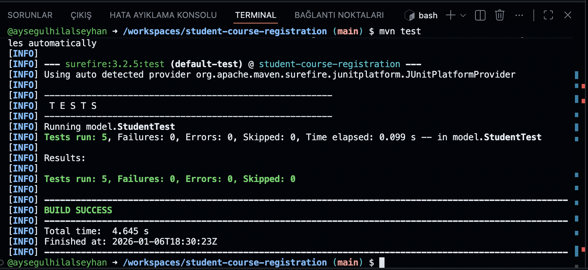

# Student Course Registration System

This project is a Java console application that simulates a student course registration system.
Students can register for courses, drop registered courses, and calculate tuition fees.
The main purpose of the project is to demonstrate Object-Oriented Programming (OOP) principles using Java.

## Features
- Course registration
- Prevention of duplicate course registration
- Dropping registered courses
- Tuition fee calculation
- Unit testing with JUnit 5

## OOP Concepts
- Inheritance (GraduateStudent extends Student)
- Polymorphism (calculateTuition method overriding)
- Interface usage (Registrable)
- Encapsulation
- Collection usage with Set

## Running the Project

To build the project:
mvn clean package

To run unit tests:
mvn test

Expected test result:
- Tests run: 5
- Failures: 0
- Errors: 0
- BUILD SUCCESS

## Unit Test Results

All unit tests were successfully executed using JUnit 5.
A screenshot of the test results is provided below.

## UML and Use Case Diagrams
- UML Class Diagram: UML.png
- Use Case Diagram: use_case_diagram.png
